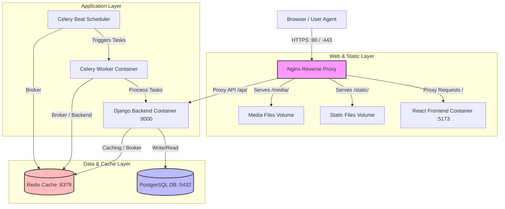

# System Architecture Documentation

This document describes the high-level system architecture, container relationships, network configuration, and core data flow sequences of the Psychological Experiment Platform.

---

## 1. System Components & Topology

The platform is designed as a distributed, containerized micro-architecture managed via Docker Compose. Nginx acts as the single entry point (reverse proxy) routing requests to the frontend client or backend services.



### Component Details
1. **Nginx Reverse Proxy (`nginx`):** Handles static assets, user uploads (media), SSL termination, and routes requests to the React application or Django backend.
2. **React Frontend (`frontend`):** Built with Vite, React 18, and TypeScript. In production, Nginx serves the compiled static build; in development, it proxies requests to the Vite dev server on port 5173.
3. **Django Backend (`backend`):** A Django 5.x REST Framework application served via Gunicorn. Exposes the REST API on port 8000.
4. **PostgreSQL Database (`db`):** Core persistent storage for participant registration, responses, daily logs, and support tickets.
5. **Redis (`redis`):** Acts as the Celery task broker, Django cache framework (for storing `current_experiment_day` and daily submission status), and Channels WebSocket layer.
6. **Celery Worker (`celery_worker`):** Executes asynchronous, long-running tasks such as generating psychometric CSV exports and sending transactional emails/WhatsApp messages.
7. **Celery Beat (`celery_beat`):** Evaluates daily schedules (at 9:00 AM and 6:00 PM local time) to enqueue reflection notifications and check overdue milestones.

---

## 2. Network Configuration & Ports

| Service | Internal Hostname | Internal Port | External Port (Host) | Protocol | Role |
| :--- | :--- | :--- | :--- | :--- | :--- |
| **Nginx** | `nginx` | `80` | `80` (or `443`) | HTTP/HTTPS | Public Gateway |
| **Frontend** | `frontend` | `5173` | None | HTTP | Vite dev server |
| **Backend** | `backend` | `8000` | None | WSGI/HTTP | Application API |
| **Database** | `db` | `5432` | None | TCP/IP | PostgreSQL |
| **Cache/Broker** | `redis` | `6379` | None | TCP/IP | Redis Cache / Celery Broker |

---

## 3. Core Sequence Flows

### 3.1 Participant Registration & Authentication
```mermaid
sequenceDiagram
    autonumber
    actor Participant as User Agent
    participant Nginx as Nginx Proxy
    participant Backend as Django API
    participant Mailjet as Mailjet SMTP
    participant DB as PostgreSQL

    Participant->>Nginx: POST /api/users/otp/ (Request OTP)
    Nginx->>Backend: Forward request
    Backend->>Backend: Generate 6-digit OTP
    Backend->>DB: Save OTP mapping
    Backend->>Mailjet: Send verification email
    Backend-->>Participant: 200 OK (OTP Sent)

    Participant->>Nginx: POST /api/users/register/ (Verify OTP & Register)
    Nginx->>Backend: Forward payload
    Backend->>DB: Query OTP valid?
    alt OTP Valid & Unique Email/Username
        Backend->>DB: Create User (deferred group)
        Backend->>DB: Create UserConsent record
        Backend-->>Participant: 201 Created
    else OTP Invalid / Validation Fails
        Backend-->>Participant: 400 Bad Request
    end
```

### 3.2 Dynamic Questionnaire Submission & Flow
```mermaid
sequenceDiagram
    autonumber
    actor Participant as User Agent
    participant Backend as Django API
    participant Cache as Redis
    participant DB as PostgreSQL

    Participant->>Backend: GET /api/users/profile/
    Backend->>DB: Fetch user profile
    DB-->>Backend: Profile data
    Backend->>Cache: Query cached due milestone
    alt Cache Miss
        Backend->>DB: Query completed ResponseSets
        Backend->>Backend: Calculate due milestone (e.g., SIGNUP)
        Backend->>Cache: Cache due milestone till midnight
    end
    Backend-->>Participant: Response with due_milestone: "SIGNUP"
    
    Participant->>Backend: POST /api/questionnaires/submit/ (Submit SIGNUP)
    Backend->>DB: Save ResponseSet and Responses
    Backend->>DB: Set onboarding_completed_at = now
    Backend->>DB: Assign Group (balanced capacity logic)
    Backend->>Cache: Clear f"user_{id}_due_milestone" cache
    Backend-->>Participant: 201 Created (Onboarded & Assigned)
```
