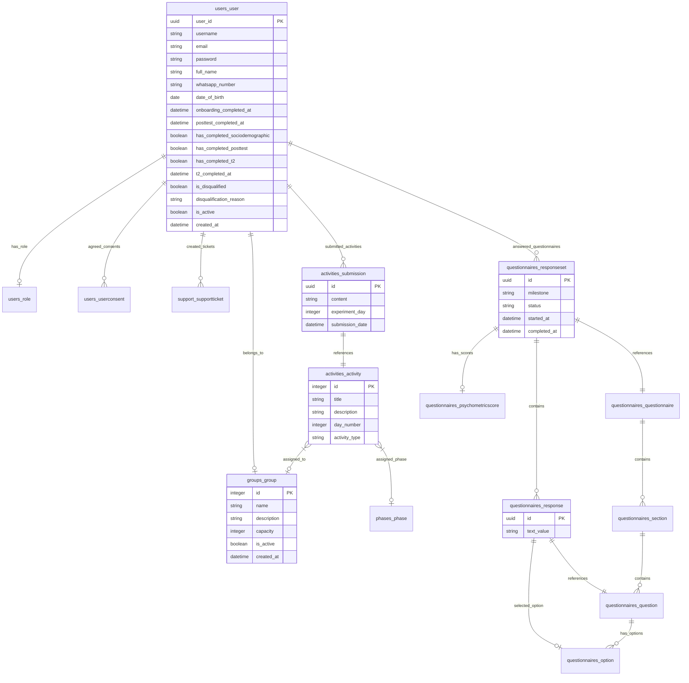

# Database & Cache Schema Documentation

This document describes the PostgreSQL relational database schema, model constraints, index optimizations, and Redis cache keys used by the Psychological Experiment Platform.

---

## 1. Entity Relationship Diagram (ERD)

The relational schema is configured around the central `User` entity. The following ERD shows the core tables and foreign key relationships.

---

## 2. Table Schemas & Definitions

### 2.1 `users_user` (Custom User Model)
Implements Django's `AbstractUser` and extends it with experiment timeline flags.
* **`user_id`**: UUID, Primary Key.
* **`username`**: Unique VARCHAR(150).
* **`email`**: Unique VARCHAR(254).
* **`has_completed_sociodemographic`**: Boolean, defaults to `False`. Marks if the T0 baseline screener is complete.
* **`onboarding_completed_at`**: DateTime, Nullable. Set when the `SIGNUP` psychometric assessment is submitted.
* **`has_completed_posttest`**: Boolean, defaults to `False`. Marks if the Day 8 (T1) post-test is complete.
* **`posttest_completed_at`**: DateTime, Nullable.
* **`has_completed_t2`**: Boolean, defaults to `False`. Marks if the 90-day follow-up (T2) is complete.
* **`t2_completed_at`**: DateTime, Nullable.
* **`is_disqualified`**: Boolean, defaults to `False`. Set to `True` if participant fails screener eligibility rules.
* **`disqualification_reason`**: VARCHAR(255), Nullable.
* **`group_id`**: ForeignKey to `groups_group`, Nullable. Defer-assigned at onboarding completion.

### 2.2 `activities_submission` (Daily Reflection Submissions)
Stores daily prompts completed by participants during their active week (Days 1 to 7).
* **`id`**: UUID, Primary Key.
* **`user_id`**: ForeignKey to `users_user`, NOT Nullable.
* **`activity_id`**: ForeignKey to `activities_activity`, NOT Nullable.
* **`content`**: TEXT. User submission content.
* **`experiment_day`**: Integer. The sequential day (1 to 7) the activity was submitted on.
* **`submission_date`**: DateTime, defaults to `timezone.now()`.
* **Constraints:**
  - `UniqueConstraint` on `(user_id, experiment_day)`: Ensures a participant can only submit once per experiment day count.
  - `UniqueConstraint` on `(user_id, TruncDate(submission_date))`: Standardized to prevent double submissions on the same calendar day.

### 2.3 `questionnaires_responseset` (Psychometric Waves)
Orchestrates the completion of baseline (T0), post-test (T1), and follow-up (T2, T3, T4) psychometric batteries.
* **`id`**: UUID, Primary Key.
* **`user_id`**: ForeignKey to `users_user`.
* **`questionnaire_id`**: ForeignKey to `questionnaires_questionnaire`.
* **`milestone`**: VARCHAR(50). Suffix codes: `SIGNUP` (T0), `7_DAYS` (T1), `3_MONTHS` (T2), `6_MONTHS` (T3), `1_YEAR` (T4).
* **`status`**: VARCHAR(20), defaults to `DRAFT`. Options: `DRAFT`, `COMPLETED`.
* **`started_at`**: DateTime.
* **`completed_at`**: DateTime, Nullable.

---

## 3. Database Indexes & Optimization

To support high-concurrency writes during daily reflection windows and performant administrative exports, the following index optimizations are applied:
1. **Foreign Key Indexes:** Standard B-Tree indexes automatically created on all `ForeignKey` relations (`user_id`, `group_id`, `activity_id`, `response_set_id`).
2. **Unique Composite Index:** `unique_user_experiment_day` B-Tree index on `(user_id, experiment_day)` on the `activities_submission` table for fast lookup.
3. **Temporal Indexes:** Index on `completed_at` on the `questionnaires_responseset` table to optimize analytics aggregation and time-based filtering queries.

---

## 4. Redis Cache Key Registry

Redis (database index `1`) caches user timeline properties and submission state to reduce redundant PostgreSQL queries.

| Cache Key | Data Type | Expiry / TTL | Invalidation Trigger | Purpose |
| :--- | :--- | :--- | :--- | :--- |
| **`user_{id}_exp_day`** | Integer | Until Midnight (PKT) | Profile modification, daily rollover | Caches the participant's current experiment day count (1 to 8+). |
| **`user_{id}_submitted_{date}`** | Boolean | Until Midnight (PKT) | Activity submission | Caches whether the user has completed their reflection for the given Pakistani local date. |
| **`user_{id}_due_milestone`** | String | Until Midnight (PKT) | ResponseSet submission (`COMPLETED`) | Caches the active psychometric wave due for the participant (e.g. `3_MONTHS`). |
| **`suicide_risk_admin_cases`** | JSON List | 24 Hours | Risk protocol trigger / Admin cache refresh task | Caches flagged suicide risk protocol events for the administrator panel. |
