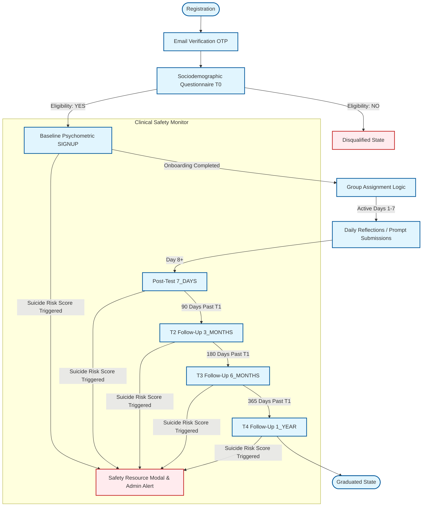
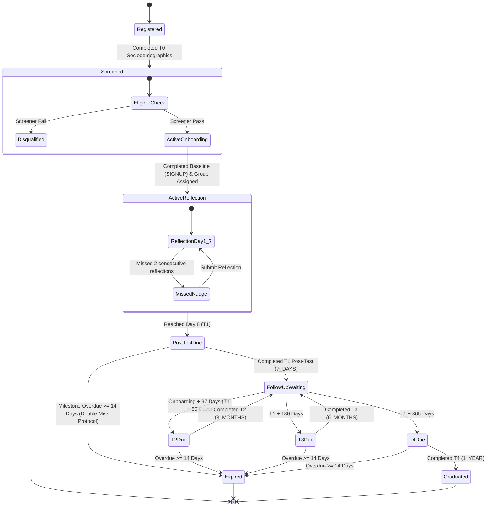

# Participant Flow & Timeline Logic

This document details the participant journey, timeline calculation rules, deferred group assignment, daily activity sequences, and clinical safety protocol triggers used in the platform.

---

## 1. Complete Participant Journey

The following diagram illustrates the workflow a participant undergoes from initial registration to their final 1-year follow-up.

---

## 2. Participant State Machine

Participants move sequentially through defined lifecycle states based on completion events and date calculations.

---

## 3. Core Logic Breakdown

### 3.1 Eligibility Screen (T0 Sociodemographics)
Immediately upon registration, participants must complete the sociodemographic questions. The system determines eligibility based on target questions (e.g. key screening criteria in `questionnaires/serializers.py` response validation).
* If a participant is marked as ineligible, `is_disqualified` is set to `True`, the `disqualification_reason` is stored, and the account is locked from accessing future reflections.

### 3.2 Deferred Group Assignment & Onboarding
Unlike traditional systems that assign groups at signup, this platform uses **deferred assignment**:
1. Participant registers and passes the eligibility screen.
2. Participant completes the **Baseline Psychometric Questionnaire (T0 `SIGNUP` milestone)**.
3. Once T0 is successfully submitted (`completed_at` is set), the system calls the group assignment service:
   - Queries all active `Group` records.
   - Assigns the user to the active group with the **fewest current participants** that is still under capacity (balanced group allocation).
   - Sets `user.onboarding_completed_at = timezone.now()`.

### 3.3 Daily Reflections Timeline (Days 1 to 7)
The 7-day reflection window is managed relative to `onboarding_completed_at`:
$$\text{Current Experiment Day} = (\text{Local Date Today} - \text{Local Onboarding Date}) + 1$$
* **Reflection Prompt:** For Days 1 to 7, the platform serves the reflection prompt assigned to the user's group for that specific day.
* **Midnight Reset:** At midnight local Pakistani time, the experiment day rolls over.
* **Submission Locking:** Users can submit only **one reflection per calendar day** (enforced by a composite cache key and unique constraint). Once a reflection is submitted for the day, the UI displays the completed content and locks the input fields.

### 3.4 Clinical Suicide Risk Protocol
During any psychometric milestone completion (T0 SIGNUP, T1, T2, T3, T4), the responses are evaluated:
1. **Trigger Condition:** If the participant selects an option indicating suicidal thoughts (e.g. response to GAD-7, PHQ-9, or SIDAS questions indicating distress, evaluated via response triggers).
2. **Immediate UI Action:** The user is immediately shown a **Safety Panel Modal** displaying local Pakistani emergency helpline numbers (Umang, Taskeen, Rescue 1122, Edhi/Chhipa).
3. **Opt-In Check-In:** The user can opt-in to request a follow-up call from a researcher.
4. **Administrative Alert:** The backend enqueues a notification to the study administrator and flags the user on the Admin Dashboard within the **Safety Risk Panel** (supported by a cached Redis lookup).
